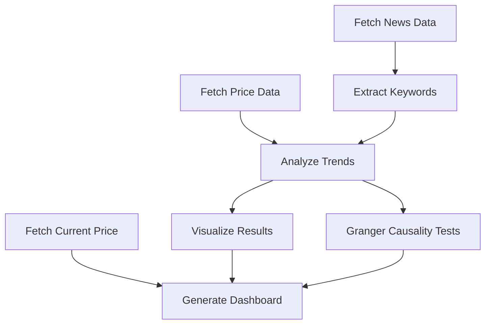

# Example: Bitcoin News Keyword Trend Analysis Application

## Example Overview
This example demonstrates an end-to-end workflow for analyzing trending keywords in Bitcoin news and their correlation with Bitcoin price movements. The workflow uses only the utility functions from `textblob1_utils.py` and can be run in a Jupyter notebook. Additionally, it performs statistical tests to assess potential causal relationships between keyword mentions and price movements.

## Workflow Steps
1. **Fetch News Data:** Retrieve Bitcoin-related news articles (from NewsAPI or sample data).
2. **Fetch Price Data:** Retrieve historical Bitcoin price data (sample data in this project).
3. **Get Current Price:** Fetch the current Bitcoin price for the dashboard.
4. **Extract Keywords:** Use TextBlob to extract noun phrases as keywords from news articles with enhanced filtering.
5. **Analyze Trends:** Count keyword frequencies, merge with price data, and compute correlations.
6. **Perform Granger Causality Tests:** Determine if keywords can predict price changes or vice versa.
7. **Visualize Results:** Plot keyword frequency vs price and a heatmap of keyword-price correlations.
8. **Generate Dashboard:** Create an interactive HTML dashboard summarizing the analysis.

## Diagrams / Flowcharts

## Data Schema
### News Data (`news_df`)
- `title`: str - Article title
- `description`: str - Article description/content
- `publishedAt`: datetime - Publication timestamp
- `source`: str - News source name
- `date`: date - Publication date
- `hour`: int - Publication hour
- `keywords`: list - Extracted keywords from article

### Price Data (`price_df`)
- `timestamp`: datetime - Price timestamp
- `price`: float - Bitcoin price in USD
- `date`: date - Price date
- `hour`: int - Price hour

### Trends Data (`merged_df`)
- `keyword`: str - Extracted keyword
- `time_window`: date - Date window for aggregation
- `count`: int - Keyword frequency in that window
- `price`: float - Bitcoin price in that window
- `frequency`: int - Total keyword frequency across all data
- `correlation`: float - Correlation coefficient between keyword frequency and price

### Causality Results
- `keyword`: str - Keyword tested
- `correlation`: float - Correlation with price
- `k2p_pvalue`: float - p-value for keyword→price causality
- `p2k_pvalue`: float - p-value for price→keyword causality 
- `k2p_significant`: bool - Whether keyword significantly predicts price
- `p2k_significant`: bool - Whether price significantly predicts keyword

## Advanced Features
- **Enhanced Keyword Extraction:** Improved filtering to identify valuable keywords.
- **Granger Causality Testing:** Statistical tests to assess if keywords can predict price changes.
- **Automatic Data Persistence:** Data is saved at each step, allowing for resuming analysis.
- **Interactive Dashboard:** Comprehensive HTML dashboard with summary tables and visualizations.
- **Docker Compatibility:** Functions detect if running in a container and adapt accordingly.

## Results / Discussion
- The workflow identifies top trending keywords in Bitcoin news and shows how their frequency correlates with price movements.
- Granger causality tests help identify which keywords might have predictive power for price changes.
- Visualizations help interpret which keywords are most associated with price changes.
- The dashboard provides a summary for easy sharing and review.
- **Limitations:** 
  - Sample data is used by default; real API keys and data will improve results.
  - Small data samples may not provide enough points for statistically significant causality testing.
  - Correlation does not imply causation, but Granger tests provide additional evidence.
  - The dashboard is functional but could be further enhanced with interactive features. 